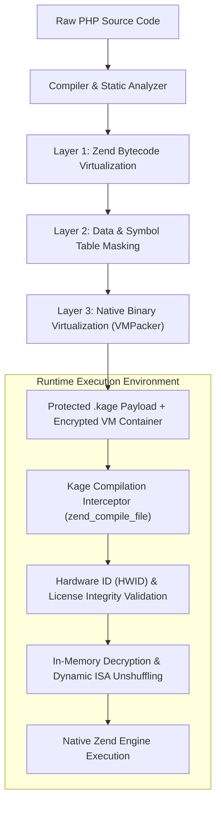

# 🛡️ Kage Security Extension

> **Enterprise-Grade PHP Bytecode Virtualization & Cryptographic Protection System**

[](https://www.php.net/)
[]()
[]()
[](LICENSE.md)

---

## 📌 Executive Summary

**Kage** is a high-performance C extension for the Zend Engine designed to safeguard PHP source code, proprietary algorithms, and sensitive assets from reverse engineering, static decompilation, and dynamic memory inspection. 

Combining **Zend-level Bytecode Virtualization**, **Dynamic Instruction Set Architecture (ISA) shuffling**, and **Native Code Virtualization via VMPacker**, Kage provides military-grade code protection while delivering native execution speed via Just-In-Time (JIT) unprotection.

---

## 🏗️ Architectural Overview

Kage implements a multi-tiered defense-in-depth protection stack:



### Protection Layers

| Layer | Component | Mechanism | Security Guarantee |
| :--- | :--- | :--- | :--- |
| **Layer 1** | **Bytecode Virtualization** | Randomized Dynamic ISA with per-file 32-bit seeds + Control Flow Flattening (CFF). | Neutralizes opcode dumpers (e.g., VLD) and decompiler execution graphs. |
| **Layer 2** | **Metadata Masking** | JIT XOR string literal encryption and symbol table obfuscation (`op_array->vars`). | Blocks static string analysis, AST reconstruction, and Reflection API probing. |
| **Layer 3** | **Native Virtualization** | Core decryption primitives compiled into custom VM bytecode via **VMPacker**. | Prevents binary reverse engineering using IDA Pro, Ghidra, or binary patch tools. |

---

## 🌐 Compatibility Matrix

Kage maintains full Zend Engine API compatibility across PHP minor releases:

| PHP Version | Zend Engine | Support Status | Tested Architecture |
| :--- | :--- | :---: | :--- |
| **PHP 7.4** | Zend Engine 3.4.x | ✅ Supported | `x86_64` / `arm64` |
| **PHP 8.0** | Zend Engine 4.0.x | ✅ Supported | `x86_64` / `arm64` |
| **PHP 8.1** | Zend Engine 4.1.x | ✅ Supported | `x86_64` / `arm64` |
| **PHP 8.2** | Zend Engine 4.2.x | ✅ Supported | `x86_64` / `arm64` |
| **PHP 8.3** | Zend Engine 4.3.x | ✅ Supported | `x86_64` / `arm64` |
| **PHP 8.4** | Zend Engine 4.4.x | ✅ Supported | `x86_64` / `arm64` |

---

## ⚡ Quick Start

### 1. Requirements

* **Operating System**: Linux (GLIBC 2.27+) or macOS (macOS 11+).
* **Dependencies**: `libsodium-dev`, `pkg-config`, `cmake` (3.16+), `gcc` (10+) or `clang`.
* **Runtime**: PHP Development Headers (`php-dev` / `php-config`).

### 2. Building from Source

```bash
# Clone repository with submodules
git clone --recursive https://github.com/bivex/Kage.git
cd Kage/c_extension

# Configure and compile release binary
mkdir -p build && cd build
cmake .. -DCMAKE_BUILD_TYPE=Release
make -j$(nproc)
```

### 3. Extension Installation

```bash
# 1. Install binary module into extension directory
cp build/kage.so $(php-config --extension-dir)/kage.so

# 2. Add INI configuration (php.ini)
cat <<EOF >> $(php-config --ini-path)/kage.ini
extension=kage.so
kage.encryption_key = "SECURE_32_CHAR_ALPHANUMERIC_KEY"
EOF
```

---

## 🔒 Code Protection API

Generate protected assets programmatically using the C-extension API:

```php
<?php
// 1. Obtain host target Hardware ID (HWID) for hardware locking
$target_hwid = kage_get_machine_id();

// 2. Encrypt source code payload
$source_code = file_get_contents('production_script.php');
$master_key  = "0123456789abcdef0123456789abcdef"; // 32-byte master key

$encrypted_blob = kage_encrypt_c(
    $source_code, 
    $master_key, 
    $target_hwid
);

// 3. Save as binary protected asset
file_put_contents('production_script.kage', base64_decode($encrypted_blob));
```

---

## 🧪 Verification & Multi-Version Test Suite

Kage includes automated Docker verification environments covering **PHP 8.1 through PHP 8.4**:

```bash
# Execute multi-version test suite across all PHP releases
./scripts/test_php_versions.sh
```

### Test Coverage Checklist

- [x] **Dynamic ISA Uniqueness**: Verifies randomized opcode mapping per file.
- [x] **OOP & Recursive Obfuscation**: Validates class method and closure protection.
- [x] **Performance Benchmark**: Confirms native execution speed post-unprotection.
- [x] **Integrity & HWID Enforcement**: Tests tamper detection and HWID lock rejection.

---

## 📁 Repository Structure

```
.
├── c_extension/               # Core C extension source code
│   ├── src/
│   │   ├── kage_compat.h      # Zend Engine multi-version compatibility layer
│   │   ├── bytecode_crypto.c  # Bytecode encryption & JIT unprotect handlers
│   │   ├── kage.c             # Extension lifecycle & compiler interception
│   │   └── kage_opcode_map.c  # Dynamic ISA opcode mapping table
│   └── CMakeLists.txt         # Modern CMake build pipeline
├── docs/                      # Technical specifications & architecture plans
├── packer/                    # VMPacker native virtualization submodule
├── scripts/                   # Automated multi-version CI/CD verification tools
└── tests/                     # Enterprise verification test suite
```

---

## 📄 License

This project is open-source software licensed under the **[MIT License](LICENSE.md)**.
